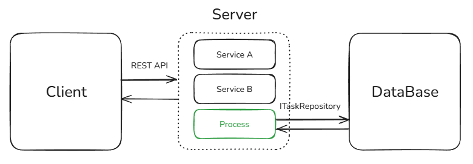

# Высокоуровневые сценарии

В данном разделе представлены несколько сценариев использования Process Aggregator в контексте взаимодействия с другими компонентами системы. Данный перечень не является исчерпывающим и при наличии потребности можно использовать фреймворк еще каким-либо образом.

## Толстый клиент

В этом сценарии предполагается, что фреймворк работает в составе клиента, например, [Electron](https://www.electronjs.org/) или его аналогов. Вся логика работы заложена на клиенте, а на сервере только хранение данных без дополнительных обработок.

В простом сценарии Process Aggregator выполняет роль менеджера управления состоянием. Слой View получает информацию, какие команды он может выполнить, какие задачи доступны для пользователя и отображает все это в интерфейсе.

В более сложных сценариях, где уже существует свой стейт менеджер, Process Aggregator может забирать на себя ответственность связанную конкретно с движением сущности по определенному бизнес-процессу. Например, существует замечательная библиотека [TanStack Query](https://tanstack.com/query/latest/docs/framework/react/overview), занимающаяся управлением состояния получения и обновления данных. Если вам нужно реализовать сценарии за пределами этой библиотеки, то вы можете использовать Process Aggregator в качестве слоя взаимодействия с данными.

## Монолит и тонкий клиент

В данном сценарии Process Aggregator используется на бэкенде, сохраняя состояние задач в базу данных. На клиенте нет дополнительной логики и он взаимодействует с сервером через REST API. При этом сервер помимо логики управления процессами может реализовывать дополнительную бизнес логику.

## Микросервис

Поскольку Process Aggregator не привязан к какой-то конкретной реализации взаимодействия с данными, он может быть реализован как отдельный микросервис, взаимодействующий с другими микросервисами через различные протоколы. При этом, например, если валидация данных реализована в другом микросервисе, то можно не дублировать логику, а просто обратиться к этому микросервису.

