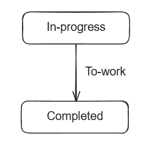
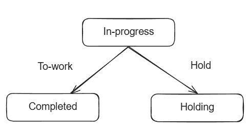
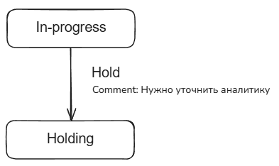
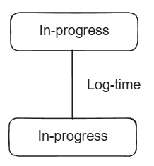
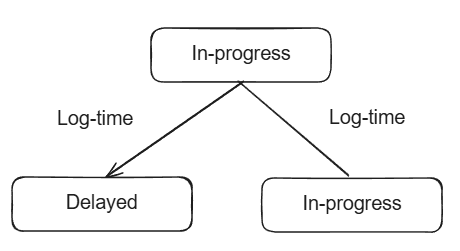
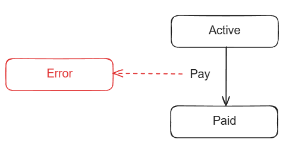
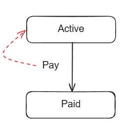
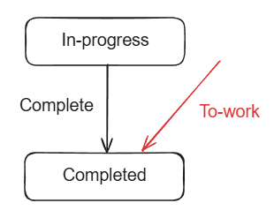

# Низкоуровневые сценария

[//]: # (TODO добавить описание)

## Переход по шагу

</a>

Переход задачи из состояния А в состояние B при выполнении команды.

## Выбор между шагами

</a>

Из состояния А можно перейти в состояние B или C, при выполнении команды 1 или команды 2.

### Возврат на предыдущий шаг

</a>

После перхода из состояния А в состояние B можно вернуться обратно в состояние A.

### Передача параметров

</a>

При переходе из состояния А в состояние B в команду можно передать параметры, которые команда может по-разнообразному использовать.

### Одна команда, разные статусы

</a>

Когда задача находится в состоянии A и вызывается команда 1, то она в зависимости от описанного в ней поведения переходил либо в состояние B, либо в состояние C.

**Пояснение к примеру.** В данном случае задача, которая находится у сотрудника, попадет в разные статусы в зависимости от его роли. Если эта стажер, то задача упадет на ревью к тимлиду, а после ревью ее уже можно закрыть, если это сам тимлид, то задача сразу завершится.

## Сервисные сценарии

### Команда без изменения статуса

</a>

Если задача находится в статусе А, то при вызове команды 1, задача также остается в статусе А.

### Команда двойного назначения

</a>

Команда 1 может перевести задачу из статусе A в статус B, а может не перевести. Все зависит от бизнес-логики команды 1.

**Пояснение к примеру** В данном случае при вызове команды `Log-time` происходит обновление истории залогированного времени. Когда это время выйдет за определенный порог, при следующем вызове команда, задача перейдет в статус `Delayed` и пользователь больше не сможет логировать время.

## Обработка ошибок

### Фатальная ошибка

</a>

При выполнении команды возникла ошибка, которую невозможно решить автоматически, либо с помощью действий пользователя.

**Пояснения к пример** в данном случае платеж невозможно осуществить, из-за ошибки в бизнес логике команды. Пользователь не в состоянии ее сам решить. Необходимо обратиться в техническую поддержку, чтобы они завели инцидент, который поможет разработчикам найти ошибку и исправить ее.

### Командная ошибка

</a>

Задача находится в статусе A. При выполнении команды 1 возникает ошибка и задача не переходит в статус B, а остается в статусе А.

**Пояснение к сценарию** В данном случае не удалось оплатить, поскольку у пользователя, например, не хватает денег на карте. Пользователь может решить эту проблему самостоятельно, поэтому задача просто остается в том же статусе.

### Некорректная команда

</a>

Задача переходит из состояния А в состояние B через команду 1. Если в состоянии А попытаться вызвать команду 2, то она не будет вызвана и вернется ошибкой.

