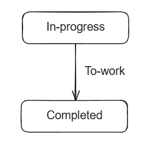
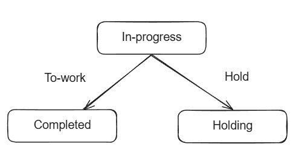
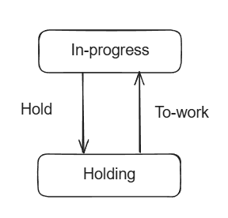
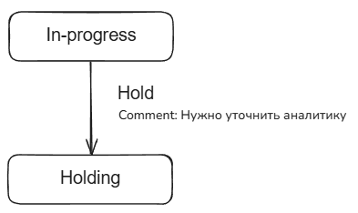
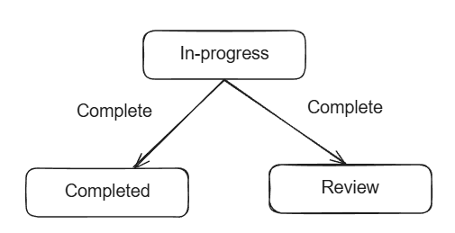
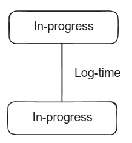
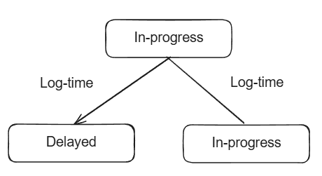
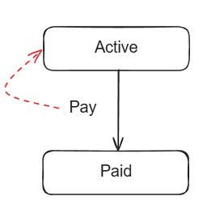
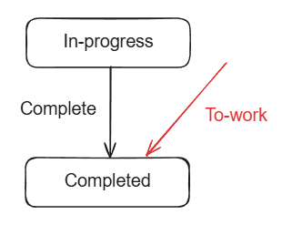

# Todo

* [x] Добавить автоматическую валидацию статуса задачи при вызове команды
* [ ] Добавить автоматическое добавление через декораторы
  * [ ] декоратор `@Action`
  * [ ] декоратор `@Relation`
  * [ ] функцию `addActionsWithDecorators`
  * [ ] функцию `addRelationsWithDecorators`
* [ ] Рефакторинг методов IAction - переделать на поля
* [ ] Добавить в Action еще одино поле - update

# Терминология

* Процесс (Process) - набор связаннных шагов, по которым движется задача. Представляет из себя граф, привязан к коду. Все остальные сущности (команды, действия, связи, шаги) являются частью процесса. Для создания процесса необходим контекст. Зона ответственности - управлять взаимодействиями всех остальных частей.
* Контекст (Context) - глобальный класс, который отвечает за управления сервисами и за создание объектов. Зона ответственности - управление памятью путем создания и уничтожения объектов.
* Задача (Task) - конкретная задача, которая движется по процессу. Представляет собой объект JSON, хранится в БД. Одним из ключевых полей задачи является статус, который отражает на каком статусе в данный момент находится задача. Зона ответственности - хранить состояние.
* Шаг (Step) - часть процесса, представляет собой узел (node) в графе. Основное ключевое поле - статус. По нему Задача понимает, к какому шагу она привязана. Зона ответственности - взаимодействие со связями.
* Связь (Relation) - часть процесса, представляет собой грань (edge) графа. Связывает шаги друг с другом. Зона ответственности - определять возможность перехода на другие шаги через взаимодействие с действиями
* Вес связи (RelationWeight) - часть процесса, представляет собой вес (weight) ребра графа. Полезная вес связи качество за связи между шагами. Ключевое поле - команда. У одной полезной нагрузки может быть только одна команда. Зона ответственности - хранить состояние связи.
* Команда (Command) - часть веса связи, представляет собой строку. Благодаря командам можно понять, какое действие нужно вызывать для команды.
* Действие (Action) - класс, который отвечает за валидацию своего выполнения и за перевод задачи на другой шаг. Зона ответсвенности - перевод задачи на другой шаг путем взаимодействия с различными внешними источниками (базы данных, очереди, микросервисы).
* Хранищиле действий (ActionStore) - создает из команды действие, которое процесс может выполнить. Находится в контексте.

# Сценарии

## Базовые сценарии

### Переход по шагу

**Стаус:** ✅

Переход задачи из состояния А в состояние B при выполнении команды.

### Выбор между шагами

**Стаус:** ✅

Из состояния А можно перейти в состояние B или C, при выполнении команды 1 или команды 2.

### Возврат на предыдущий шаг

**Стаус:** ✅

После перхода из состояния А в состояние B можно вернуться обратно в состояние A.

### Передача параметров

**Стаус:** ⚠️

При переходе из состояния А в состояние B в команду можно передать параметры, которые команда может по разнообразному использовать.

### Одна команда, разные статусы

**Стаус:** ⚠️

Когда задача находится в состоянии A и вызывается команда 1, то она в зависимости от описанного в ней поведения переходил либо в состояние B, либо в состояние C.

**Пояснение к примеру.** В данном случае задача, которая находится у сотрудника, попадет в разные статусы в зависимости от его роли. Если эта стажер, то задача упадет на ревью к тимлиду, а после ревью ее уже можно закрыть, если это сам тимлид, то задача сразу завершится.

## Сервисные сценарии

### Команда без изменения статуса

**Стаус:** ⚠️

Если задача находится в статусе А, то при вызове команды 1, задача также остается в статусе А.

### Команда двойного назначения

**Стаус:** ⚠️

Команда 1 может перевести задачу из статусе A в статус B, а может не перевести. Все зависит от бизнес-логики команды 1.

**Пояснение к примеру** В данном случае при вызове команды `Log-time` происходит обновление истории залогированного времени. Когда это время выйдет за определенный порог, при следующем вызове команда, задача перейдет в статус `Delayed` и пользователь больше не сможет логировать время.

## Обработка ошибок

### Фатальная ошибка

**Стаус:** ⚠️

При выполнении команды возникла ошибка, которую невозможно решить автоматически, либо с помощью действий пользователя.

**Пояснения к пример** в данном случае платеж невозможно осуществить, из-за ошибки в бизнес логике команды. Пользователь не в состоянии ее сам решить. Необходимо обратиться в техническую поддержку, чтобы они завели инцидент, который поможет разработчикам найти ошибку и исправить ее.

### Командная ошибка

**Стаус:** ⚠️

Задача находится в статусе A. При выполнении команды 1 возникает ошибка и задача не переходит в статус B, а остается в статусе А.

**Пояснение к сценарию** В данном случае не удалось оплатить, поскольку у пользователя, например, не хватает денег на карте. Пользователь может решить эту проблему самостоятельно, поэтому задача просто остается в том же статусе.

### Некорректная команда

**Стаус:** ⚠️

Задача переходит из состояния А в состояние B через команду 1. Если в состоянии А попытаться вызвать команду 2, то она не будет вызвана и вернется ошибкой.

# Описание REST API

* `POST /api/process/:process/tasks/payload` - передается payload, который создает задачу
* `GET /api/process/:process/tasks?q=...` - получения списка задач
* `GET /api/process/:process/tasks/:id` - возвращает задачу по id
* `PUT /api/process/:process/tasks/:id/payload` - обновляет существующую задачу
* `POST /api/process/:process/tasks/command/:command/` - запускает выполнение команды

